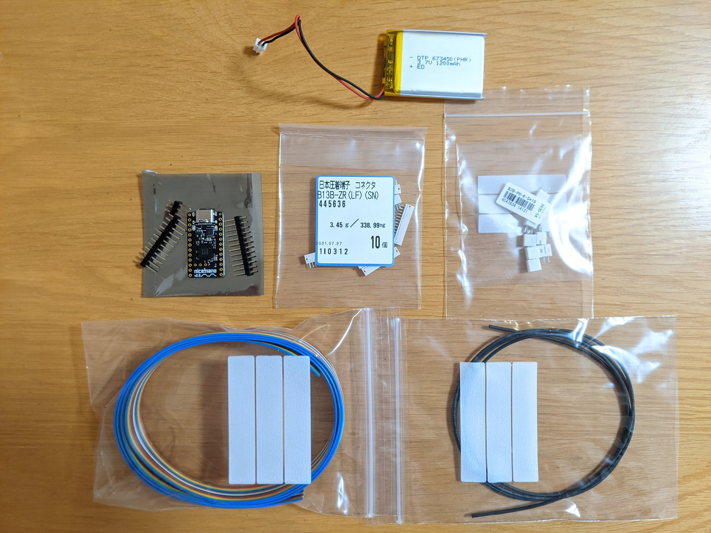
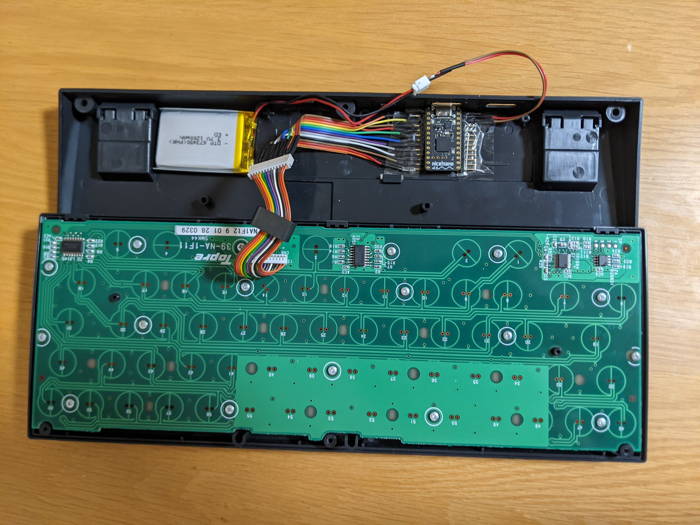
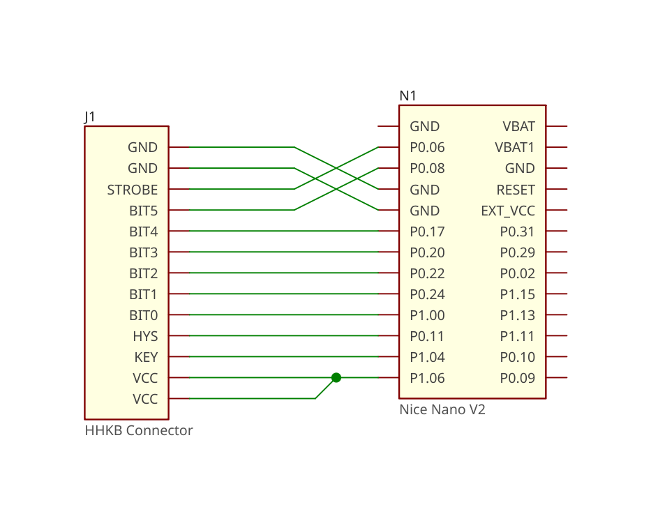

# HHKB Pro 2 with ZMK firmware

This project provides an out-of-tree Zephyr module and shield definition
for the HHKB Pro2 daugther board.

The `hhkb_pro2` shield defines the default HHKB keymap and `zmk,kscan`
chosen. Any board can use the `hhkb_pro2` shield by defining the
`hhkb_pro2_connector` gpio nexus node. Examples can be find in
[custom_pro2.overlay](config/boards/shields/custom_pro2/custom_pro2.overlay) and
[whkb_pro2.dts](config/boards/arm/whkb_pro2/whkb_pro2.dts).

## Customizing

Clone this repository then add your keymap overlay to the `custom_pro2` shield.
You can also create more complex customization by creating entirely new boards or
shields.

The default Github Actions will build the firmware using the [build.yml](./build.yaml)
definition.

📢 If you build some custom boards or configs, please share a picture and tips to the
[discussion](https://github.com/kanru/hhkb-zmk/discussions/11) thread!

## Build locally

Follow the steps in the [official ZMK document](https://zmk.dev/docs/user-setup) to setup build environment.

Setup Zephyr

```sh
west init -l config
west update
```

To build nice_nano_v2 based board:

```sh
west build -s zmk/app -p -b nice_nano_v2 -- \
    -DSHIELD="hhkb_pro2 custom_pro2" \
    -DZMK_CONFIG=$PWD/config
```

or to build WHKB Pro2:

```sh
west build -s zmk/app -p -b whkb_pro2 -- \
    -DSHIELD=hhkb_pro2 \
    -DZMK_CONFIG=$PWD/config
```

The finished UF2 file is at `build/zephyr/zmk.uf2`

## Soldering a custom board

The default configuration in `custom_pro2` is based on
the `nice_nano_v2` board. It only uses the pins on the
left side. The pins' order is upside down so the wires
can be bend easily under the case.

It take advantages of the high drive capability of nRF52
GPIO to power the HHKB Pro2 daughter board.






 